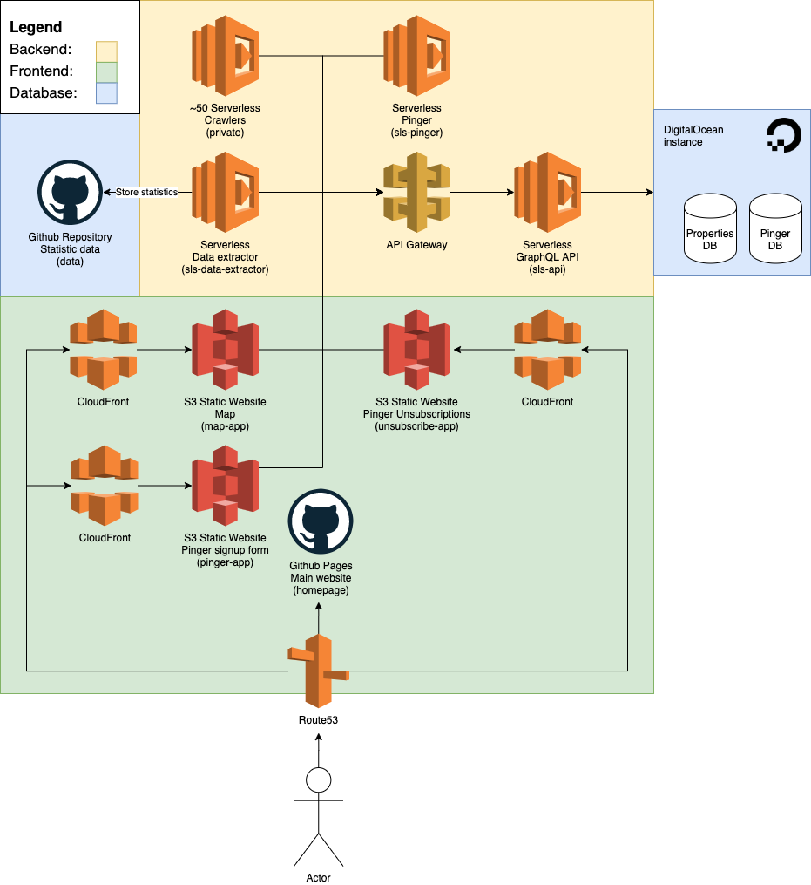

# Docs
A high-level overview of the Brokalys tech.

<!-- Image source stored in: https://app.diagrams.net/#G1JDARyR95jIQxrockt5DWa3oAO-M-QbD --->

## Goals
Brokalys is a real estate aggregation and analysis platform built by [Matiss Janis Aboltins] as a side-project.

The main goals are:
1) Make local real estate analysis available to everyone;
2) Automate everything: data collection, analysis, normalization and display process;
3) Make it cheap.

All of this is achieved through the clever use of modern technology and lots of tweaking and optimizations. This includes - using serverless technologies, pre-calculating statistical data, using static web hosting for frontends.

## Frontend
Each project is a separate micro-frontend with only one functionality. This helps keep project complexity and size down. Furthermore, it creates the opportunity to try new things and experiment in an isolated environment.

The CI/CD pipeline setup for each project is very important to guarantee reproducible and automated deployments. Some projects might not see a commit in months or even years, so CI/CD is very important.

### [map-app]
The map is the most commonly used public frontend. It's an easy way to view real estate data for a specific region or criteria. This could be - the median price change within a region, the buy-to-let ratio for apartments, the number of classifieds published within a certain month, or many more things.

[View map-app LIVE version][live-map-app]

### [pinger-app]
Pinger app is a very simple Vue application for signing up for the Brokalys PINGER. It sends out email notifications when a real-estate classified has been crawled that matches a user predefined criteria (e.g. classified type, price range, region, room count, etc.).

[View pinger-app LIVE version][live-pinger-app]

### [unsubscribe-app]
Simple React app for unsubscribing to PINGERs.

### [homepage]
The main entry point to the Brokalys platform - the main website. Very minimalistic Jekyll landing page.

[View homepage LIVE version][live-homepage]

## Backend
Broakyls backend is built to be 1) scalable; 2) fast; 3) cheap. It consists of many serverless functions that work independently - just like microservices. They communicate with each other via API calls or SNS notifications.

### Crawlers
The meat of the entire Brokalys operation. Around 50 unique real estate crawlers for gathering a complete dataset of the real-estate market. Since this project is the single most important piece of the operation, the source code is private.

### [sls-api]
A minimalistic serverless GraphQL API acting as a gateway between the DigitalOcean MySQL database and every other service. Data can be retrieved, inserted, and updated **only** via sls-api.

### [sls-pinger]
A scheduled serverless function for checking if a classified matches some customer pre-defined parameters. If they match - send the customer a notification email.

This service also takes care of rate-limiting the emails sent out (100/customer/month). This is to save costs on the email sending service. The limit can be increased if a customer communicates with the Brokalys team directly.

### [sls-data-extraction]
Functions for extracting statistical data from the database. Stores this information in a static CSV file on Github for public and easy access.

The data is available in the [data repository][data].

## Database
The database is the most expensive and most crucial piece of infrastructure in the Brokalys platform.

As of this writing, the MySQL database is hosted on a cheap DigitalOcean instance. It can be only accessed via [sls-api]. It has two databases - `properties` and `pingers`. sls-api has write&read permissions to the `properties` database, but not update or delete due to security concerns. And sls-api also has write, update and read access to the `pingers` database.

A public, static [data] database is also available on GitHub. It contains various statistical data exported from the Brokalys DB.

[Matiss Janis Aboltins]: https://mja.lv
[map-app]: https://github.com/brokalys/map
[pinger-app]: https://github.com/brokalys/pinger-app
[unsubscribe-app]: https://github.com/brokalys/unsubscribe-app
[homepage]: https://github.com/brokalys/homepage
[sls-api]: https://github.com/brokalys/sls-api
[sls-pinger]: https://github.com/brokalys/sls-pinger
[sls-data-extraction]: https://github.com/brokalys/sls-data-extraction
[data]: https://github.com/brokalys/data
[live-map-app]: https://map.brokalys.com
[live-pinger-app]: https://pinger.brokalys.com
[live-homepage]: https://brokalys.com
